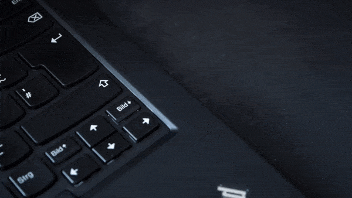
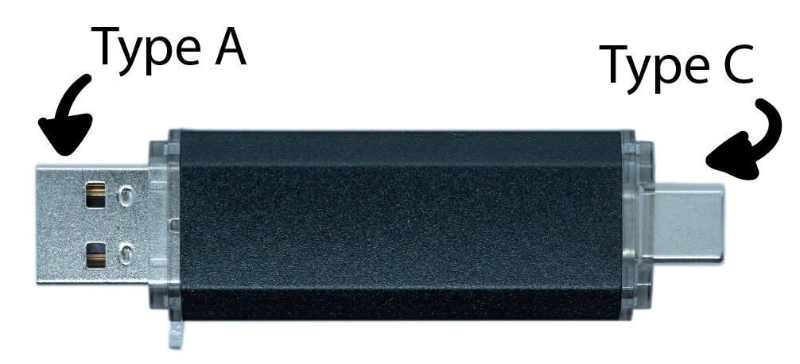
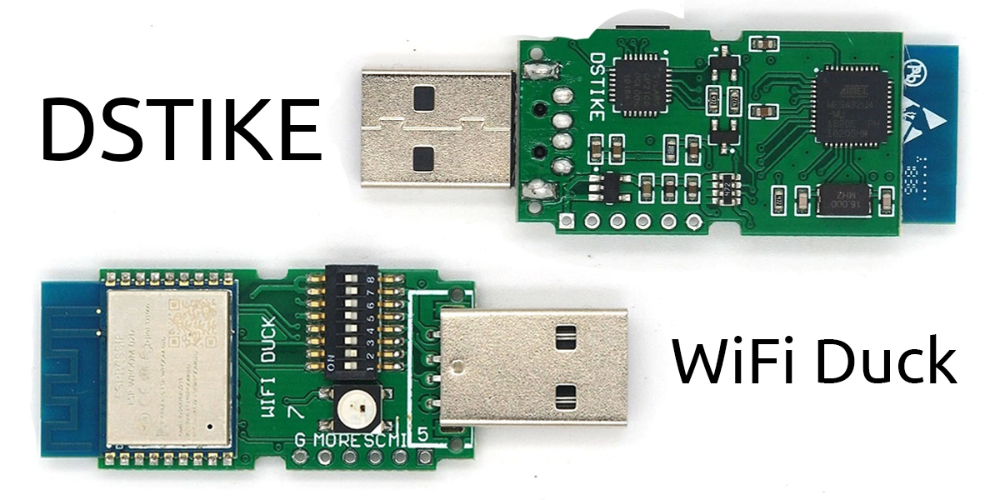

  <a href="https://www.youtube.com/watch?v=sSJuGXd8QRk">
    
     
    <b>Watch the full video</b>
  </a>

# WiFi Duck

A user-friendly open-source project to learn about keystroke injection attacks or 'BadUSBs'. By emulating a USB keyboard, BadUSBs can gain full access to a computer in a matter of seconds!  

Unlike with other BadUSBs, you don't need to install an app, log in, compile or copy scripts to an SD card. 
You simply connect via WiFi to manage all your scripts from within a web interface.



**Disclaimer:**

This tool is intended to be used for testing, training, and educational purposes only.  
Never use it to do harm or create damage!  



## Malduino W

  <a href="https://maltronics.com/collections/malduinos/products/malduino-w">
    
     
    <b>Go to Maltronics.com</b>
  </a>

This encased and inconspicuous looking BadUSB by Maltronics comes with both USB-A and USB-C.
It runs the WiFi Duck firmware and works plug and play.  
ℹ️ **[Documentation can be found here](http://docs.maltronics.com/malduino-w/)**

## DSTIKE WiFi Duck

  <a href="https://dstike.com/collections/frontpage/products/dstike-wifi-duck">
    
     
    <b>Got to DSTIKE.com</b>
  </a>

A custom designed development board which comes preflashed with the WiFi Duck firmware by Travis Lin.  