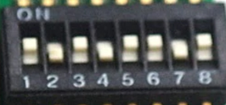
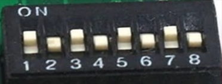
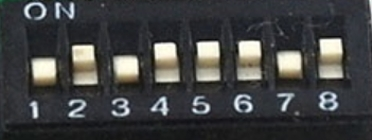

## About

This open-source project aims to provide a user-friendly tool to learn about keystroke injection attacks and 'BadUSBs'.  

By emulating a USB keyboard, tools like this can gain full access to any computer with a USB port in a matter of seconds!  
This is made possible by the fact that keyboards are trusted by computers. You can have full control over a computer with just a keyboard.  
A BadUSB pretends to be a keyboard to the computer to send keystrokes. 
But unlike a human, it can type hundreds of characters per second. 
By using a simple scripting language, it's easy to make BadUSBs type whatever you want. 

With the WiFi Duck, you can simply connect via WiFi to manage all scripts
from within a web interface. This means that, unlike other BadUSBs, you don't need to install an app, log in, compile or copy scripts to an SD card.  

## Usage

  <a href="https://www.youtube.com/watch?v=sSJuGXd8QRk">
    
     
    <b>Watch the full video</b>
  </a>

1. Plug in your WiFi Duck
2. Connect to the WiFi network `wifiduck` with the password `wifiduck`
3. Open a browser and visit `192.168.4.1`
4. Write, save and run your first Ducky Script
5. [Recommended] Open `Settings` (top right corner) and update SSID and password

**Help I forgot the password:**
[Flash the ESP8266](#flash-esp8266), but make sure that you select `Erase Flash: Sketch + WiFi Settings`
under Tools in the Arduino IDE.  

If you have further questions, check out the [issue section](https://github.com/spacehuhn/WiFiDuck/issues).  

## Hardware

### Malduino W

  <a href="https://maltronics.com/collections/malduinos/products/malduino-w">
    
     
    <b>Go to Maltronics.com</b>
  </a>

A nicely encased, inconspicuous looking BadUSB by Maltronics.  
Having USB-A and USB-C makes it compatible with all kind of devices.  
It comes flashed with the WiFi Duck firmware and works plug and play.  
ℹ️ **[Documentation can be found here](http://docs.maltronics.com/malduino-w/)**

### DSTIKE WiFi Duck

  <a href="https://dstike.com/collections/frontpage/products/dstike-wifi-duck">
    
     
    <b>Got to DSTIKE.com</b>
  </a>

A custom designed development board which comes preflashed with this software by Travis Lin.  

You can update the ESP8266 over the air and flash the Atmega32u4 via Arduino, all while enclosed in its neat little case.  
📺 **[Watch the How to Update Tutorial here](https://youtu.be/e3-nsOjclsY)**.

If you wish to develop your own software or help improve this one, 
the 8-bit DIP-switch makes it easy for you to access the Atmega32u4 or ESP8266 independently. 
For more info see [Flash Software](#flash-software).

| Mode | Atmega32u4 | ESP8266 | DIP-switch | Image |
| --- | --- | --- | --- | --- |
| Default Operating Mode | USB | On | 10101101 |  |
| Atmega32u4 Flash Mode | USB | Off |10101010 |  |
| ESP8266 Flash Mode | Off | USB | 01011101 |  |

## Disclaimer

This tool is intended to be used for testing, training, and educational purposes only.  
Never use it to do harm or create damage!  

The continuation of this project counts on you!  